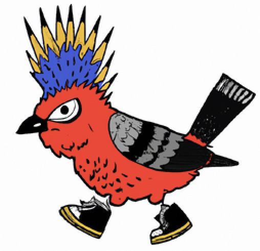

 

  
  

# [My Personal Website][project-url]

[Explore the Docs][repo-url] --- [View Demo][project-url] --- [Report Bug][issues-url]

<!-- TABLE OF CONTENTS -->

  
Table of Contents

  <ol>
    <li>
      <a href="#about-the-project">About The Project</a>
      <ul>
        <li><a href="#built-with">Built With</a></li>
      </ul>
    </li>
    <li><a href="#license">License</a></li>
    <li><a href="#contact">Contact</a></li>
  </ol>

<!-- ABOUT THE PROJECT -->

---

## About The Project

[![Project Screen Shot][project-screenshot]][project-url]
[![Contributors][contributors-shield]][contributors-url]
[![Forks][forks-shield]][forks-url]
[![Stargazers][stars-shield]][stars-url]
[![Issues][issues-shield]][issues-url]
[![MIT License][license-shield]][license-url]

My personal website is a portfolio website that showcases my recent coding projects. It was built using React, Bootstrap, HTML, and CSS, and makes use of the Swiper library for interactive scrolling, the Framer Motion library for animations, and Type-Animation for engaging text effects on the home page. The website is continuously integrated through GitHub and deployed on Netlify. The website serves as a platform for me to share my work and connect with potential employers or clients.

_I'd love to hear any feedback or just thoughts. Feel free to reach out at my contact info below. Cheers!_

### Tech Stack

[![React][react.js]][react-url]
[![Bootstrap][bootstrap.com]][bootstrap-url]
[![framer]][framer-url]
[![swiper]][swiper-url]
[react-icons](https://www.npmjs.com/package/react-icons)

<!-- LICENSE -->

## License

Distributed under the [MIT License][license-url]. See `LICENSE.md` for more information.

<!-- CONTACT -->

## Contact

- [Email](mailto:justinjontsugranes@gmail.com?subject=Hi 'Hi, from GitHub!')
- [Website](https://justintsugranes.com)
- [GitHub @justintsugranes](https://github.com/justintsugranes)
- [LinkedIn @justin-tsugranes](https://linkedin.com/in/justintsugranes)
- [Twitter @justintsugranes](https://twitter.com/justintsugranes)

## 🤝 Support

Give a ⭐️ if you like this project and if you like my work, maybe you would like to

(<a href="#readme-top">back to top</a>)

<!-- MARKDOWN LINKS & IMAGES -->
<!-- https://www.markdownguide.org/basic-syntax/#reference-style-links -->

[repo-url]: https://github.com/justintsugranes/justintsugranes_website
[project-url]: https://www.justintsugranes.com
[project-screenshot]: client/src/assets/project-screenshot.jpg
[contributors-shield]: https://img.shields.io/github/contributors/justintsugranes/justintsugranes_website.svg?style=for-the-badge
[contributors-url]: https://github.com/justintsugranes/justintsugranes_website/graphs/contributors
[forks-shield]: https://img.shields.io/github/forks/justintsugranes/justintsugranes_website.svg?style=for-the-badge
[forks-url]: https://github.com/justintsugranes/justintsugranes_website/network/members
[stars-shield]: https://img.shields.io/github/stars/justintsugranes/justintsugranes_website.svg?style=for-the-badge
[stars-url]: https://github.com/justintsugranes/justintsugranes_website/stargazers
[issues-shield]: https://img.shields.io/github/issues/justintsugranes/justintsugranes_website.svg?style=for-the-badge
[issues-url]: https://github.com/justintsugranes/justintsugranes_website/issues
[license-shield]: https://img.shields.io/github/license/justintsugranes/justintsugranes_website.svg?style=for-the-badge
[license-url]: https://github.com/justinTsugranes/justintsugranes_website/blob/main/LICENSE.md

<!-- TECH SHIELDS -->

[react.js]: https://img.shields.io/badge/React-20232A?style=for-the-badge&logo=react&logoColor=61DAFB
[react-url]: https://reactjs.org/
[bootstrap.com]: https://img.shields.io/badge/Bootstrap-563D7C?style=for-the-badge&logo=bootstrap&logoColor=white
[bootstrap-url]: https://getbootstrap.com
[framer]: https://img.shields.io/badge/Framer-0055FF?style=for-the-badge&logo=framer&logoColor=white
[framer-url]: https://www.framer.com/motion/
[swiper]: https://img.shields.io/badge/Swiper-6332F6?style=for-the-badge&logo=swiper&logoColor=white
[swiper-url]: https://swiperjs.com/
